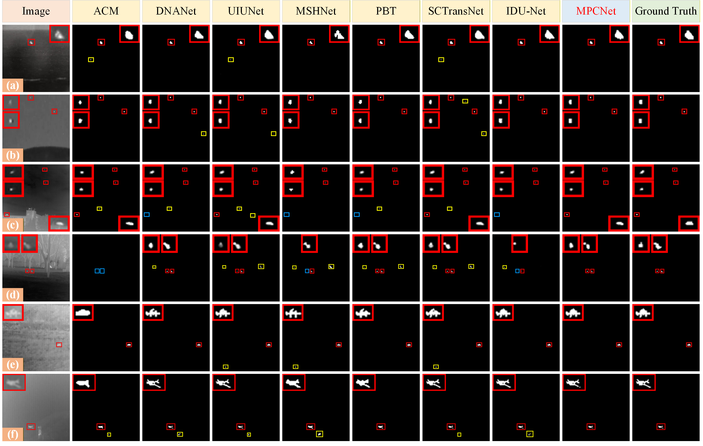
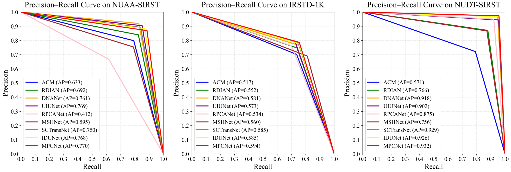

# MPCNet: Multi-scale Perception and Cross-attention Feature Fusion Network for Infrared Small Target Detection

On January 5, 2026, our paper was officially accepted by the ***IEEE Transactions on Geoscience and Remote Sensing***. We sincerely thank all the reviewers and editors for their valuable comments and patient guidance during the review process, which played a crucial role in improving the quality of the paper. We are deeply honored and express our heartfelt gratitude for their support and assistance. [[paper]](https://ieeexplore.ieee.org/document/11346810)

## Network


## Datasets
**Our project has the following structure:**
  ```
  ├───dataset/
  │    ├── NUAA-SIRST
  │    │    ├── image
  │    │    │    ├── Misc_1.png
  │    │    │    ├── Misc_2.png
  │    │    │    ├── ...
  │    │    ├── mask
  │    │    │    ├── Misc_1.png
  │    │    │    ├── Misc_2.png
  │    │    │    ├── ...
  │    │    ├── train_NUAA-SIRST.txt
  │    │    │── train_NUAA-SIRST.txt
  │    ├── IRSTD-1K
  │    │    ├── image
  │    │    │    ├── XDU0.png
  │    │    │    ├── XDU1.png
  │    │    │    ├── ...
  │    │    ├── mask
  │    │    │    ├── XDU0.png
  │    │    │    ├── XDU1.png
  │    │    │    ├── ...
  │    │    ├── train_IRSTD-1K.txt
  │    │    ├── train_IRSTD-1K.txt
  │    ├── ...  
  ```
<be>

## Results
#### Qualitative Results



#### Precision–Recall Curve



#### Supplementary noise experiment
To comprehensively evaluate the stability and generalization ability of the proposed MPCNet under various noise interferences, we first used the NoisySIRST dataset constructed by [SeRankDet](https://github.com/GrokCV/SeRankDet), which simulates typical imaging noise interference in real-world applications by introducing Gaussian noise of different intensities (σ = 10, 20, 30). Furthermore, using the same construction scheme, we developed two new noise variants based on the original NUAA-SIRST dataset to further validate the model's robustness in non-Gaussian noise environments:
SPNoisySIRST: This dataset adds salt-and-pepper noise with densities of 1%, 3%, and 5%, simulating pulse-type interference caused by sensor failure or transmission errors.
SNoisySIRST: This dataset contains speckle noise with variances of 1%, 3%, and 5%. This noise is widespread in infrared or radar images and mainly reflects brightness fluctuations caused by multiplicative interference.
The two datasets above can be downloaded from [here](https://drive.google.com/file/d/1kkoi5UcaqlRiURACvlkzfQRV5IzSRJ_e/view?usp=sharing).
<table>
<thead>
<tr>
<th rowspan="3">Methods</th>
<th colspan="6">NoisySIRST (Gaussian noise)</th>
<th colspan="6">SNoisySIRST (Speckle noise)</th>
<th colspan="6">SPNoisySIRST (Salt-and-pepper noise)</th>
</tr>
<tr>
<th colspan="2">σ=10</th><th colspan="2">σ=20</th><th colspan="2">σ=30</th>
<th colspan="2">σ=1</th><th colspan="2">σ=3</th><th colspan="2">σ=5</th>
<th colspan="2">σ=1</th><th colspan="2">σ=3</th><th colspan="2">σ=5</th>
</tr>
<tr>
<th>IoU</th><th>Fm</th><th>IoU</th><th>Fm</th><th>IoU</th><th>Fm</th>
<th>IoU</th><th>Fm</th><th>IoU</th><th>Fm</th><th>IoU</th><th>Fm</th>
<th>IoU</th><th>Fm</th><th>IoU</th><th>Fm</th><th>IoU</th><th>Fm</th>
</tr>
</thead>
<tbody>
<tr><td>ACM</td><td>67.36</td><td>80.38</td><td>68.55</td><td>81.24</td><td>62.18</td><td>76.56</td><td>70.97</td><td>82.91</td><td>68.35</td><td>81.07</td><td>67.07</td><td>80.17</td><td>64.34</td><td>78.18</td><td>61.71</td><td>76.16</td><td>54.35</td><td>70.34</td></tr>
<tr><td>RDIAN</td><td>70.91</td><td>82.86</td><td>69.27</td><td>81.72</td><td>65.99</td><td>79.37</td><td>73.57</td><td>84.66</td><td>71.14</td><td>82.99</td><td>70.81</td><td>82.79</td><td>69.25</td><td>81.71</td><td>66.21</td><td>79.59</td><td>64.64</td><td>78.40</td></tr>
<tr><td>DNANet</td><td>77.01</td><td>86.87</td><td>70.56</td><td>82.64</td><td>68.59</td><td>81.26</td><td>75.53</td><td>85.95</td><td>72.66</td><td>84.09</td><td>72.20</td><td>83.78</td><td>72.32</td><td>83.84</td><td>71.25</td><td>83.12</td><td>70.90</td><td>82.85</td></tr>
<tr><td>UIUNet</td><td>77.77</td><td>87.58</td><td>74.53</td><td>85.31</td><td>68.70</td><td>81.34</td><td>80.08</td><td>88.79</td><td>77.43</td><td>87.10</td><td>74.21</td><td>85.06</td><td>76.23</td><td>87.00</td><td>74.05</td><td>84.95</td><td>72.64</td><td>84.02</td></tr>
<tr><td>RPCANet</td><td>65.44</td><td>79.11</td><td>50.58</td><td>67.18</td><td>44.46</td><td>61.56</td><td>62.59</td><td>76.99</td><td>60.41</td><td>75.32</td><td>59.97</td><td>74.98</td><td>54.12</td><td>70.23</td><td>44.62</td><td>61.70</td><td>38.22</td><td>55.30</td></tr>
<tr><td>MSHNet</td><td>73.54</td><td>84.63</td><td>70.91</td><td>82.86</td><td>68.77</td><td>81.37</td><td>70.53</td><td>82.59</td><td>69.47</td><td>81.84</td><td>68.73</td><td>81.35</td><td>72.64</td><td>84.01</td><td>69.43</td><td>81.78</td><td>66.02</td><td>79.41</td></tr>
<tr><td>PBT</td><td>71.81</td><td>83.59</td><td>67.01</td><td>80.25</td><td>62.47</td><td>76.90</td><td>75.68</td><td>86.16</td><td>71.52</td><td>83.40</td><td>69.60</td><td>82.07</td><td>64.56</td><td>78.47</td><td>61.68</td><td>76.30</td><td>59.38</td><td>74.51</td></tr>
<tr><td>SCTransNet</td><td>73.61</td><td>84.68</td><td>70.81</td><td>82.78</td><td>68.51</td><td>81.18</td><td>77.06</td><td>86.93</td><td>74.80</td><td>85.45</td><td>72.91</td><td>84.22</td><td>74.22</td><td>85.08</td><td>73.74</td><td>84.75</td><td>73.10</td><td>84.33</td></tr>
<tr><td>IDU-Net</td><td>72.89</td><td>84.20</td><td>71.36</td><td>83.22</td><td>67.83</td><td>80.76</td><td>77.69</td><td>87.31</td><td>77.67</td><td>87.29</td><td>69.18</td><td>81.68</td><td>74.02</td><td>84.92</td><td>73.10</td><td>84.35</td><td>71.60</td><td>83.34</td></tr>
<tr><td>MPCNet</td><td>78.13</td><td>87.61</td><td>75.62</td><td>85.99</td><td>69.14</td><td>81.65</td><td>78.66</td><td>87.93</td><td>78.23</td><td>87.68</td><td>76.00</td><td>86.23</td><td>78.19</td><td>87.60</td><td>73.31</td><td>84.45</td><td>73.13</td><td>84.35</td></tr>
</tbody>
</table>


#### Quantitative Results on NUAA-SIRST, IRSTD-1K and NUDT-SIRST

| Dataset         | IoU (x10(-2)) | Pd(x10(-2))| Fa (x10(-6))|  F (x10(-2))|
| ------------- |:-------------:|:-----:|:-----:|:-----:|
| NUAA-SIRST    | 77.47  |  96.20 | 13.72 | 87.30 |
| IRSTD-1K      | 67.24  |  92.26 | 11.41 | 80.40 |
| NUDT-SIRST    | 93.33  |  99.15 | 1.68  | 96.55 |


*This code is highly borrowed from [SCTransNet](https://github.com/xdFai/SCTransNet). Thanks to Shuai Yuan.

*The overall repository style is highly borrowed from [DNANet](https://github.com/YeRen123455/Infrared-Small-Target-Detection). Thanks to Boyang Li.


